# Lista Deck

- ***Tutti*** i deck fino a maggio 2008.
- *Starter*: deck usciti in Italia dedicati ad un personaggio dell'anime.
- *Structure*: deck usciti in Italia dedicati ad un *archetipo*.
- *Custom*: deck personalizzati e testati.
- *WIP* (work in progress): non ancora testati.

# [2008 Custom: Elementar HERO](https://duelingnexus.com/editor/b51387e437bb2d64fd132f15e8e6acfe)

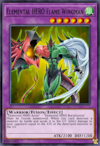

Lista fusioni: [cliccare qui](www/HERO.png).

# [2008 Custom: Cyber Dragon](https://duelingnexus.com/editor/c5363858df4dfa9755fa01c646514cae)

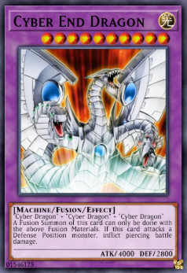

# [2008 Custom: Dark World](https://duelingnexus.com/editor/bfc62a1497e31dc3b67688c323297a1c)

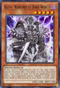

# [2008 Custom: Armed Dragon](https://duelingnexus.com/editor/da4d00eb863ebf777710ea83845e6d48)

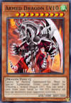

# [2008 WIP: The Dark Emperor](https://duelingnexus.com/editor/c631dca13280cd8e54c7adbcab04ce99)

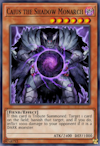

# [2008 WIP: Six Samurai](https://duelingnexus.com/editor/8a29d7eff1fd8cea5cb3328d6ca366ab)

# [2008 WIP: Destiny HERO](https://duelingnexus.com/editor/a8b91a37ca3d000836fae0f80999073b)

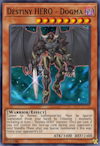

# [2007 WIP: Rise of the Dragon Lords](https://duelingnexus.com/editor/9f2125283f1eedfc0155c1109940e447)

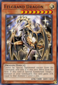

# [2007 Structure: Machine Re-Volt](https://duelingnexus.com/editor/651fa12da2be0a417a25ae3c60389d4b)

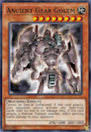

# [2007 Starter: Syrus Truesdale](https://duelingnexus.com/editor/a38721fa2f0f1914504ddb3b03d2f6cb)

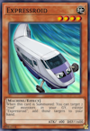

# [2007 Starter: Jaden Yuki](https://duelingnexus.com/editor/1c851da6fb815e3ace6fcf3a8f6ed8e7)

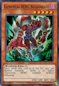

# [2007 WIP: Gladiator Beast](https://duelingnexus.com/editor/b51ed43c9536e899751b0978d3187a48)

# [2007 WIP: Crystal Beast](https://duelingnexus.com/editor/9f480ed31b88f29f3f98c21f016e9538)

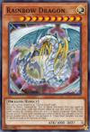

# [2006 Structure: Spellcaster's Judgment](https://duelingnexus.com/editor/8731b9b86534f64f66e71ec286643dbf)

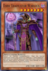

# [2006 Structure: Lord of the Storm](https://duelingnexus.com/editor/8b665593661b866d0243766a5c0fce3e)

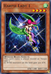

# [2006 Structure: Invincible Fortress](https://duelingnexus.com/editor/eefdf90802477c72185880ef898f1128)

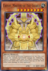

# [2006 Structure: Dinosaurs' Rage](https://duelingnexus.com/editor/70a1bbeb5f56f4506ffcbf8445955fb0)

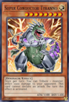

# [2006 Starter: Starter Deck](https://duelingnexus.com/editor/5ee8ae1ed352c0edb83972f34ac63403)

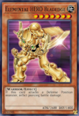

# [2006 WIP: Kuriboh](https://duelingnexus.com/editor/c884522829d1f3d043f89ae970fbd369)

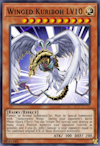

# [2005 Structure: Zombie Madness](https://duelingnexus.com/editor/a5ffad663866ad2892882b8a8aedac1c)

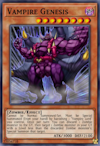

# [2005 Structure: Warrior's Triumph](https://duelingnexus.com/editor/bfaa74c0ff87ecf4d757bfe64681ae0e)

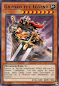

# [2005 Structure: Fury From The Deep](https://duelingnexus.com/editor/433a73435d72736f840c890e6fb246ab)

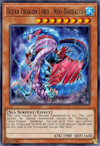

# [2005 Structure: Dragon's Roar](https://duelingnexus.com/editor/18effad1bd245365bc929344201bbbeb)

# [2005 Structure: Blaze of Destruction](https://duelingnexus.com/editor/a30d1248e4fc76e5396ad501e207dc80)

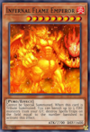

# [2005 WIP: Monarch](https://duelingnexus.com/editor/2cfd0b0506c6607d0b498669100493eb)

# [2005 WIP: Exodia Necross](https://duelingnexus.com/editor/dd8b57f12430005dac17b0dbaae37eab)

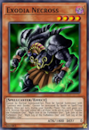

# [2004 Starter: Yugi Evolution](https://duelingnexus.com/editor/2d44f5c60560dfbdde0a5c06fbe3a158)

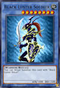

# [2004 Starter: Kaiba Evolution](https://duelingnexus.com/editor/095460c46c9ec4ba1e65e8a1bbb00372)

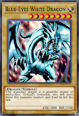

# [2004 WIP: CHAOS](https://duelingnexus.com/editor/582e2dd409eb99ac2853c8255c64a138)

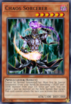

# [2003 WIP: Great Moth](https://duelingnexus.com/editor/632dbdde6f1be16b87d944aac7ddc458)

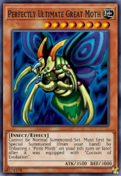

# [2003 Starter: Pegasus](https://duelingnexus.com/editor/239abb0ff17965d4fdfb45f70ecb2ecd)

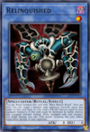

# [2003 Starter: Joey](https://duelingnexus.com/editor/7f75e333a60a1eecb0b555fdcea72a3a)

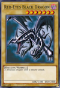

# [2003 WIP: XYZ Union](https://duelingnexus.com/editor/501f581eeab7e832ee024e9362729d92)

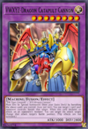

# [2003 WIP: Gravekeeper's](https://duelingnexus.com/editor/56053234876437efa3ea71886fc52007)

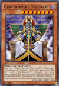

# [2002 Starter: Yugi](https://duelingnexus.com/editor/dbd263b0d940eabfea33fd0af75c2cfd)

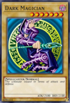

# [2002 Starter: Kaiba](https://duelingnexus.com/editor/6234543add2eed631d9ce23530fa830f)

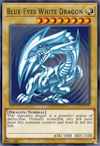
