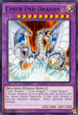

Lista Deck
========================================

Tutti i deck dal 2002 al 2008.

Pro
========================================

Personalizzati e testati. Ci vuole un po' di esperienza.

### [Elementar HERO](https://duelingnexus.com/editor/b51387e437bb2d64fd132f15e8e6acfe)

Lista fusioni: [cliccare qui](www/HERO.png).

### [Cyber Dragon](https://duelingnexus.com/editor/c5363858df4dfa9755fa01c646514cae)

### [Dark World](https://duelingnexus.com/editor/bfc62a1497e31dc3b67688c323297a1c)

### [Armed Dragon](https://duelingnexus.com/editor/da4d00eb863ebf777710ea83845e6d48)

Structure
========================================

Deck ufficiali usciti in Italia. Pronti all'uso.

### [2005 Dragon's Roar](https://duelingnexus.com/editor/18effad1bd245365bc929344201bbbeb)

### [2005 Zombie Madness](https://duelingnexus.com/editor/a5ffad663866ad2892882b8a8aedac1c)

### [2005 Blaze of Destruction](https://duelingnexus.com/editor/a30d1248e4fc76e5396ad501e207dc80)

### [2005 Fury From The Deep](https://duelingnexus.com/editor/433a73435d72736f840c890e6fb246ab)

### [2005 Warrior's Triumph](https://duelingnexus.com/editor/bfaa74c0ff87ecf4d757bfe64681ae0e)

### [2006 Spellcaster's Judgment](https://duelingnexus.com/editor/8731b9b86534f64f66e71ec286643dbf)

### [2006 Invincible Fortress](https://duelingnexus.com/editor/eefdf90802477c72185880ef898f1128)

### [2006 Lord of the Storm](https://duelingnexus.com/editor/8b665593661b866d0243766a5c0fce3e)

### [2006 Dinosaurs' Rage](https://duelingnexus.com/editor/70a1bbeb5f56f4506ffcbf8445955fb0)

### [2007 Machine Re-Volt](https://duelingnexus.com/editor/651fa12da2be0a417a25ae3c60389d4b)

### [2007 Rise of the Dragon Lords](https://duelingnexus.com/editor/9f2125283f1eedfc0155c1109940e447)

### [2008 The Dark Emperor](https://duelingnexus.com/editor/c631dca13280cd8e54c7adbcab04ce99)

Starter
=======================================

Deck ufficiali usciti in Italia e dedicati ad un personaggio dell'anime. Per neotifi.

### [2002 Yugi](https://duelingnexus.com/editor/dbd263b0d940eabfea33fd0af75c2cfd)

### [2002 Kaiba](https://duelingnexus.com/editor/6234543add2eed631d9ce23530fa830f)

### [2003 Joey](https://duelingnexus.com/editor/7f75e333a60a1eecb0b555fdcea72a3a)

### [2003 Pegasus](https://duelingnexus.com/editor/239abb0ff17965d4fdfb45f70ecb2ecd)

### [2004 Yugi Evolution](https://duelingnexus.com/editor/2d44f5c60560dfbdde0a5c06fbe3a158)

### [2004 Kaiba Evolution](https://duelingnexus.com/editor/095460c46c9ec4ba1e65e8a1bbb00372)

### [2006 Starter Deck](https://duelingnexus.com/editor/5ee8ae1ed352c0edb83972f34ac63403)

### [2007 Jaden Yuki](https://duelingnexus.com/editor/1c851da6fb815e3ace6fcf3a8f6ed8e7)

### [2007 Syrus Truesdale](https://duelingnexus.com/editor/a38721fa2f0f1914504ddb3b03d2f6cb)

Work in Progress
=======================================

Da ottimizzare e testare.

### [Six Samurai](https://duelingnexus.com/editor/8a29d7eff1fd8cea5cb3328d6ca366ab)

### [Destiny HERO](https://duelingnexus.com/editor/a8b91a37ca3d000836fae0f80999073b)

### [Gladiator Beast](https://duelingnexus.com/editor/b51ed43c9536e899751b0978d3187a48)

### [Crystal Beast](https://duelingnexus.com/editor/9f480ed31b88f29f3f98c21f016e9538)

### [Kuriboh](https://duelingnexus.com/editor/c884522829d1f3d043f89ae970fbd369)

### [Monarch](https://duelingnexus.com/editor/2cfd0b0506c6607d0b498669100493eb)

### [Exodia Necross](https://duelingnexus.com/editor/dd8b57f12430005dac17b0dbaae37eab)

### [CHAOS](https://duelingnexus.com/editor/582e2dd409eb99ac2853c8255c64a138)

### [Great Moth](https://duelingnexus.com/editor/632dbdde6f1be16b87d944aac7ddc458)

### [XYZ Union](https://duelingnexus.com/editor/501f581eeab7e832ee024e9362729d92)

### [Gravekeeper's](https://duelingnexus.com/editor/56053234876437efa3ea71886fc52007)

